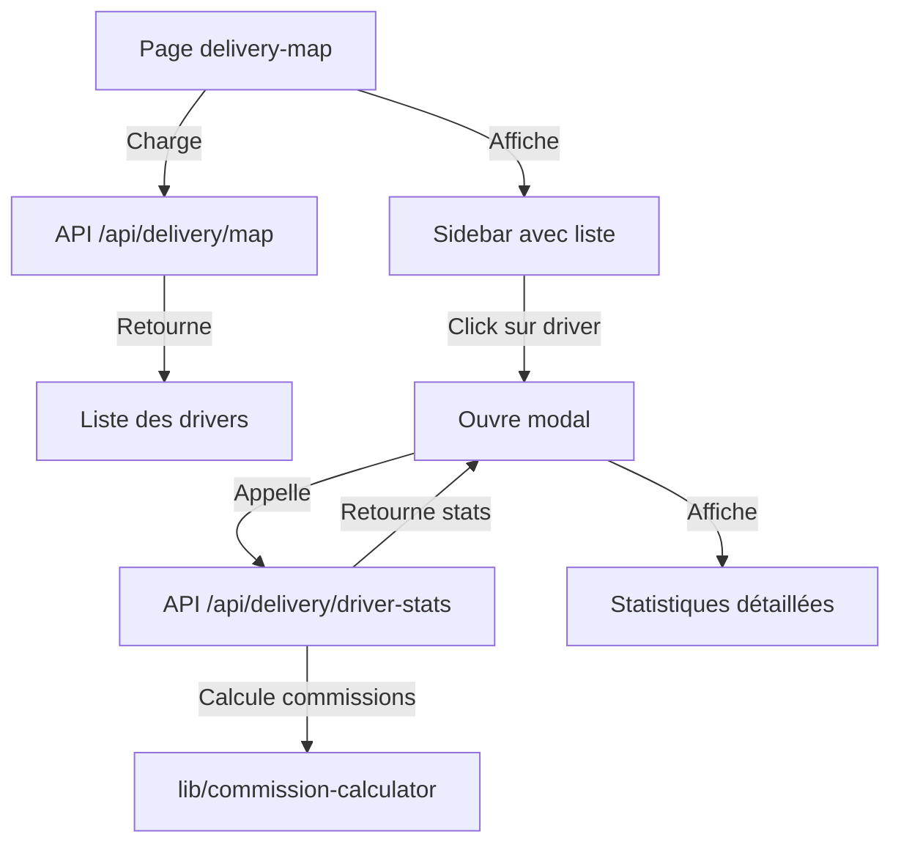

# Liste des Livreurs sur la Carte de Livraison

## Vue d'ensemble

Cette fonctionnalité ajoute une liste des livreurs actifs sur la gauche de la page **Carte de Livraison** (`/dashboard/delivery-map`). En cliquant sur un livreur, un modal s'ouvre pour afficher ses statistiques détaillées.

## Fichiers créés/modifiés

### 1. Nouvelle API Route : `/api/delivery/driver-stats`
**Fichier** : `app/api/delivery/driver-stats/route.ts`

Cette API récupère les statistiques détaillées d'un livreur spécifique.

#### Paramètres de requête
- `driverId` (obligatoire) : ID du livreur
- `period` (optionnel) : Période de statistiques
  - `today` : Aujourd'hui
  - `week` : 7 derniers jours
  - `month` : 30 derniers jours
  - `all` : Toutes les périodes (par défaut)

#### Réponse
```json
{
  "success": true,
  "data": {
    "driver": {
      "id": "string",
      "name": "string",
      "phone": "string",
      "email": "string | null",
      "isActive": boolean,
      "joinedAt": "string (ISO date)"
    },
    "stats": {
      "revenue": number,              // Chiffre d'affaires en commissions
      "acceptedOrders": number,       // Commandes acceptées
      "deliveredOrders": number,      // Commandes livrées
      "cancelledOrders": number,      // Commandes annulées
      "averageOrderAmount": number,   // Panier moyen
      "totalDeliveries": number       // Total livraisons
    },
    "assignedZones": [
      {
        "id": "string",
        "name": "string",
        "color": "string"
      }
    ],
    "period": "string"
  }
}
```

#### Calcul du chiffre d'affaires

Le chiffre d'affaires est calculé en fonction des **commissions sur les commandes livrées** :

**Règles de commission** (définies dans `lib/commission-calculator.ts`) :
- Entre 6 500 et 7 000 FCFA : **1 000 FCFA**
- Entre 7 000 et 8 000 FCFA : **1 500 FCFA**
- ≥ 8 500 FCFA : **2 000 FCFA**

Ces règles sont identiques à celles utilisées dans l'API mobile `/api/mobile/commission`.

### 2. Nouveau composant : `DriverStatsModal`
**Fichier** : `components/delivery/driver-stats-modal.tsx`

Modal responsive affichant les statistiques détaillées d'un livreur.

#### Fonctionnalités
- **Filtres de période** : Aujourd'hui, 7 jours, 30 jours, Tout
- **Statistiques principales** :
  - Chiffre d'affaires (en commissions)
  - Commandes acceptées
  - Commandes livrées
  - Commandes annulées
  - Panier moyen
  - Total des livraisons
- **Informations du livreur** :
  - Téléphone
  - Email
  - Date d'inscription
  - Statut actif/inactif
- **Zones assignées** avec badges colorés

#### Props
```typescript
interface DriverStatsModalProps {
  driverId: string | null
  driverName: string
  open: boolean
  onOpenChange: (open: boolean) => void
}
```

### 3. Page modifiée : `/dashboard/delivery-map`
**Fichier** : `app/dashboard/delivery-map/page.tsx`

#### Changements
- Ajout d'un **sidebar gauche** (320px) affichant la liste des livreurs actifs
- Intégration du `DriverStatsModal`
- Layout flex avec sidebar + carte

#### Structure du sidebar
- **En-tête** : Titre + compteur de livreurs actifs
- **Liste scrollable** de livreurs avec :
  - Avatar circulaire avec initiale (couleur = couleur de zone)
  - Nom du livreur
  - Numéro de téléphone
  - Badge de zone assignée
  - Nombre de commandes actives
  - Indicateur cliquable (icône chevron)

## Flux de données



## Utilisation de l'API de commission

L'API `/api/delivery/driver-stats` s'inspire de `/api/mobile/commission` pour calculer les revenus :

```typescript
import { calculateTotalCommissions } from "@/lib/commission-calculator"

// Récupère les commandes livrées
const deliveredOrders = await prisma.storeOrder.findMany({
  where: {
    deliveryPersonId: driverId,
    status: "DELIVERED",
    deliveredAt: { gte: startDate, lte: now }
  },
  select: { total: true }
})

// Calcule les commissions
const stats = calculateTotalCommissions(deliveredOrders)
// stats.totalCommission = chiffre d'affaires du livreur
```

## Responsive Design

- **Desktop** : Sidebar fixe à gauche (320px) + carte
- **Mobile** : Le layout reste flexible grâce à Tailwind CSS
- **Scroll** : Liste des livreurs scrollable avec `ScrollArea` de shadcn/ui

## Composants UI utilisés

- `Dialog` : Modal principal
- `Badge` : Zones et compteurs
- `Button` : Items de liste cliquables
- `ScrollArea` : Liste scrollable
- `Tabs` : Filtres de période

## Exemple d'utilisation

```typescript
// Dans delivery-map/page.tsx
const handleDriverClick = (driver: Driver) => {
  setSelectedDriver({ id: driver.id, name: driver.name })
  setIsStatsModalOpen(true)
}

return (
  <div className="h-screen w-full flex">
    {/* Sidebar */}
    <div className="w-80 border-r bg-white">
      {/* Liste des livreurs */}
    </div>

    {/* Carte */}
    <div className="flex-1">
      <DeliveryMapV2 {...mapData} />
    </div>

    {/* Modal */}
    <DriverStatsModal
      driverId={selectedDriver?.id}
      driverName={selectedDriver?.name}
      open={isStatsModalOpen}
      onOpenChange={setIsStatsModalOpen}
    />
  </div>
)
```

## Améliorations futures

1. **Filtres avancés** :
   - Filtrer par zone
   - Filtrer par statut (actif/inactif)
   - Recherche par nom

2. **Graphiques** :
   - Évolution des commissions dans le temps
   - Graphique des performances

3. **Export** :
   - Exporter les statistiques en PDF/CSV

4. **Notifications** :
   - Alertes pour les livreurs peu actifs
   - Badges pour nouvelles commandes

5. **Tracking GPS** :
   - Position en temps réel des livreurs
   - Intégration avec un système de géolocalisation

## Notes techniques

- La liste des livreurs se met à jour automatiquement toutes les **30 secondes** (rafraîchissement de la page)
- Les statistiques du modal sont rechargées à chaque changement de période
- Les commissions sont calculées côté serveur pour garantir la cohérence
- Les couleurs des zones sont récupérées dynamiquement de la base de données

## Tests recommandés

1. Vérifier l'affichage avec 0, 1, 5, 20+ livreurs
2. Tester les différentes périodes de filtrage
3. Vérifier le calcul des commissions avec différents montants
4. Tester le responsive design
5. Vérifier les performances avec beaucoup de commandes

